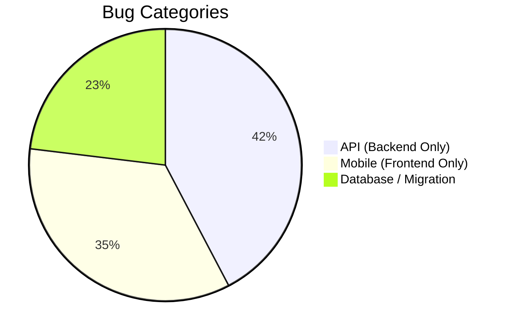

# Bug Fixes & Logical Changes Plan (Testing Observations & Migration Audit)

This document provides a comprehensive audit of the data migration for the **NIK** and **SIK** regions from the source Excel files to the Oracle database. It also categorizes the 20 original bugs/CRs and the new SIK Field Crop issues from [Testing Observations.xlsx](file:///Users/amod/Documents/projects/freelancing/farmer%20new/documents/Codebase/v5/reward-api/bugs/Testing%20Observations.xlsx) and outlines the logical plans and necessary clarifications for their resolution.

> [!IMPORTANT]
> **Constraint Check**: As requested, this plan contains **strictly logical plans and analysis** with **no source code changes**.

---

## Part 1: Data Migration Verification (Excel vs. Database)

We performed a row-by-row count comparison and integrity check between the source Excel files located in `migration_scripts/data/` and the Oracle database tables.

### 1. Row Count Audit Summary

| Table / Entity | Excel Source File | Excel Rows (excluding headers) | Oracle DB Rows (after corrected import) | Match Status | Notes |
| :--- | :--- | :---: | :---: | :---: | :--- |
| **BLOCKING_PERIOD** | `Blocking period_NIK & SIK.xlsx` | **41** | **41** | **100% Match** | Excel sheet has 43 rows total, including 2 regional header labels (`NIK crops` and `SIK crops`). Crop rows total 19 (NIK) + 22 (SIK) = 41. |
| **FIELD_CROPS_ADVISORY** | `Field Crops_Advisory_NIK_16_4_2026.xls` `Field Crops_Advisory_SIK_16_04_2026.xlsx` | **2565** | **2565** | **100% Match** | NIK: 731 rows, SIK: 1834 rows. Match is exact. |
| **HORTI_MONTHS_CROPS_ADVISORY** | `Horti Months NIK _corrected_7.5.2026.xlsx` `Horti Months crops SIK.xlsx` | **2458** | **2458** | **100% Match** | NIK: 1227 rows, SIK: 1231 rows. Match is exact. |
| **HORTI_WEEKS_CROPS_ADVISORY** | `Horti Weeks NIK_corrected_7.5.2026.xlsx` `Horti Weeks crops SIK.xlsx` | **729** | **729** | **100% Match** | NIK: 332 rows, SIK: 397 rows. Match is exact. |
| **CONTINGENCY_CROP_PLAN** | `corrected_Contingecy crop_NIK_UAS Dharwad.xlsx` `SIK_Contingency crop plans.xlsx` | **199** | **199** | **100% Match** | NIK: 154 rows, SIK: 45 rows. Match is exact. |

---

### 2. Discovered Migration Issues & Fix Plan

During the verification, we identified why the database row counts initially mismatched and resolved them as follows:

1. **SQL\*Plus Substitution Variables (`&`)**:
   - *Problem*: String values in SQL scripts containing ampersands (`&`) (e.g., in blockings/advisories) prompted SQL*Plus to request input variables. This ate subsequent command lines, causing execution syntax errors and skipping rows.
   - *Fix*: Prefixed all executions with `SET DEFINE OFF;`.
2. **SQL\*Plus Blank Line Termination**:
   - *Problem*: Multi-line Kannada instructions in the SQL script had empty lines inside `CLOB` literals. By default, SQL*Plus treats blank lines as command buffer terminators, breaking long insert statements.
   - *Fix*: Executed with `SET BLANKLINES ON;` or utilized Node.js scripts to read the raw SQL files and execute inserts one-by-one.
3. **String Literals Exceeding 4000 Characters (ORA-01704)**:
   - *Problem*: SIK Contingency plans (specifically the Tumakuru `> September 30` scenario) contained long text exceeding the 4000-character SQL limit.
   - *Fix*: Split the text into parts using `TO_CLOB('part1') \|\| TO_CLOB('part2')`.
4. **Trailing COMMIT Statements in batched chunks**:
   - *Problem*: The last insert in the Horti Months script appended `COMMIT;` inside the last split statement, which threw an `ORA-03405` error when executed via standard thin-client commands.
   - *Fix*: Filtered out trailing `COMMIT` statements from parsed SQL chunks.

---

### 3. Detailed Audit of SIK Field Crop Failures

Following the new QA test results indicating failures for various crops and DAS in region SIK, we conducted a targeted database audit. The findings point to 6 core structural inconsistencies:

1. **Sowing Month Casing and Spacing Mismatch**:
   - The query filters by `SOWING_MONTH` using a case-sensitive exact match.
   - For `COTTON`, the query asks for `'MAY-JUNE'` (normalized from `'MAY - JUNE'`), but the advisory table contains `'May-June'`.
   - For `MAIZE`, the query asks for `'JUNE-JULY'`, but the table contains `'June-July'`.
   - Similar mismatches affect **Millets** (Proso, Little, Barnyard, Kodo, Foxtail) and **Soybean**.
2. **Sowing Month Text Discrepancies**:
   - For `GROUNDNUT`, `BLOCKING_PERIOD` has `'JUNE-JULY'`, but `FIELD_CROPS_ADVISORY` has `'June'`.
   - For `REDGRAM`, `BLOCKING_PERIOD` has `'MAY - JULY'`, but `FIELD_CROPS_ADVISORY` has specific fortnights: `'MAY 15 - JUNE 30'`, `'JULY 1 - JULY 31'`, and `'August 1 - August 20'`.
   - For `GREENGRAM`, `BLOCKING_PERIOD` has `'JANUARY - FEBRUARY, APRIL - MAY'`, but `FIELD_CROPS_ADVISORY` has `'January-February & April-May'`.
   - For `SORGHUM`, `BLOCKING_PERIOD` has `'SEPTEMBER 15 - OCTOBER 15'`, but `FIELD_CROPS_ADVISORY` has `'September 15 to October 15'`.
3. **Advisory Crop Name Mismatches**:
   - `FINGER MILLET` (English) in `BLOCKING_PERIOD` maps to `'RAGI'` in `FIELD_CROPS_ADVISORY`.
   - `BROWN TOP MILLET` (with spaces) in `BLOCKING_PERIOD` maps to `'BROWNTOP MILLET'` (no spaces) in `FIELD_CROPS_ADVISORY`.
4. **Null CROP_ID in Advisory Table**:
   - For `CASTOR`, the `CROP_ID` column in `FIELD_CROPS_ADVISORY` is `NULL`. Since the query filters on `CROP_ID = :cropId`, it returns 0 rows.
5. **Post-Harvest Weather Independence (NIL/NIL Fallback)**:
   - For late stages (e.g. `Blackgram` and `Greengram` at 155 DAS), the database has `PREVIOUS_WEEK_RAINFALL = 'NIL'` and `NEXT_WEEK_RAINFALL_FORECAST = 'NIL'`.
   - When the API queries using calculated weather categories (e.g., `'NORMAL'` and `'YES'`), it fails to match these weather-independent rows.
6. **Calendar Year Boundary Restriction**:
   - Crops sowed late in the previous year (e.g., Rabi Sorghum, Sugarcane sowed in October/November 2025) are blocked from selection because the `/period_info` API only computes and returns ranges for the current year.

---

## Part 2: Categorization of Testing Observations

We have categorized all observations from the sheet into three distinct workstreams:

1. **API**: Backend logic modifications (no mobile app or database schema/migration changes needed).
2. **Mobile**: Mobile client modifications (no backend API changes or database changes needed).
3. **Database / Migration**: Changes in the database content, SQL scripts, or migration files.

| Row # / Crop | Issue Description | Priority | Category |
| :---: | :--- | :---: | :---: |
| 5 | Crop practice images not displaying. | P2 | **API** |
| 6 | Retain crop advisory flow for unregistered farmers. | P3 | **Mobile** |
| 7 | NIK first stage data correction. | P1 | **Database / Migration** |
| 8 | SIK "NO" condition flow failing (June 1–19). | P1 | **API** |
| 9 | Date picker: Open previous years for horticulture. | P1 | **Mobile** |
| 10 | Contingency plan data not displaying correctly in some cases. | P1 | **Database / Migration** |
| 11 | English translation displays Kannada text. | P1 | **API** |
| 12 | Previous Rainfall window calculation (7 days instead of 3). | P1 | **API** |
| 13 | Grapes (SIK) advisory not fetched for age groups `>1`. | P1 | **API** |
| 14 | Papaya Kannada translation missing (displays English). | P1 | **Database / Migration** |
| 15 | Registration UI: Mark mandatory fields with bold and red asterisk (`*`). | P1 | **Mobile** |
| 16 | Crop Sowing question label update: change to "Have you sown?". | P1 | **Mobile** |
| 17 | Video tutorials: update headings and link URLs. | P1 | **Mobile** |
| 18 | Restrict sowing date picker range & block dates beyond harvest + 30 days. | P1 | **Mobile & API** |
| 19 | Remove "Pre-harvesting" form fields and screens. | P1 | **Mobile** |
| 20 | Regionalize crop list (Rice / Aerobic Rice blocking periods in NIK). | P1 | **Mobile & Database** |
| 21 | NIK "NO" condition flow returns incorrect scenario sets. | P1 | **API** |
| 22 | Cowpea (NIK) Kannada unicode text corruption. | P1 | **Database / Migration** |
| 23 | Tomato / Onion weeks advisory fallback when gaps exist. | P1 | **API** |
| 24 | Update labels on the "Contact Us" screen. | P2 | **Mobile** |
| **Cotton / Maize / Millets** | Sowing Month Casing and spacing mismatch failures in SIK. | P1 | **API** |
| **Groundnut / Redgram / Sugarcane / Sorghum** | Sowing Month text discrepancy failures in SIK. | P1 | **API & Database** |
| **Finger Millet / Browntop** | Crop name mismatches in database tables. | P1 | **API & Database** |
| **Castor** | null CROP_ID prevents matching SIK Castor. | P1 | **Database / Migration** |
| **Blackgram / Greengram** | 155 DAS failures due to NIL/NIL rainfall requirement at post-harvest. | P1 | **API** |
| **Sugarcane / Sorghum / Rice(IR)** | Previous year sowing dates calendar block. | P1 | **API & Mobile** |

---

## Part 3: Logical Fix Plans by Category

### Stream A: API (Backend Changes Only)

#### 1. Crop Practice Images Not Rendering (Row 5)
- **Root Cause**: In `src/models/rewardFarmerDetails.js` (`getCropPracticeByName`), the Oracle LOB stream reader for the `CROP_IMAGE` column contains a copy-paste index/assignment bug. It concatenates the binary buffer chunks and writes them to `row.PRACTICES` instead of `row.CROP_IMAGE` as a `utf8` string. This leaves the image column as an raw unconverted Lob stream and breaks base64 rendering in the app.
- **Logical Fix Plan**:
  1. Remove the early return inside the stream reader.
  2. Assign the base64 encoded string directly to `row.CROP_IMAGE`:
     `row.CROP_IMAGE = buffer.toString('base64');`
  3. Ensure `row.PRACTICES` retains its original text-based instructions.

#### 2. SIK "NO" Condition Flow Failure (Row 8)
- **Root Cause**: In `src/models/contingencyCropPlan.js` (`getScenariosFromDate`), the code returns NIK fortnightly scenarios (such as `June 1 - 15` or `June 15 - 30`) for dates prior to June 20th. SIK region districts do not have these scenarios; SIK contingency plans start on June 20th. This leads to 0 rows returned and a 404 error.
- **Logical Fix Plan**:
  1. Detect the region code for the requested district.
  2. If the region is `SIK` and the input date falls before June 20 (June 1–19), override the scenario target to return the earliest available SIK range: `June 20 - July 10`.

#### 3. English Language Selection Shows Kannada (Row 11)
- **Root Cause**: In `contingencyCropPlanController.js`, the backend maps English columns to key suffixes ending in `_ENG` (e.g., `AGRICULTURE_MEASURES_ENG`, `PLANT_PROTECTION_MEARURES_ENG`). However, the database schema and mobile frontend expect key suffixes ending in `_EN` (e.g., `AGRICULTURE_MEASURES_EN`).
- **Logical Fix Plan**:
  - Update backend controllers to return BOTH suffixes in the response payload for all advisory types (`FIELD`, `HORTI_MONTHS`, `HORTI_WEEKS`):
    - Return `AGRICULTURE_MEASURES_EN` and `AGRICULTURE_MEASURES_ENG`.
    - Return `PLANT_PROTECTION_MEARURES_EN` and `PLANT_PROTECTION_MEARURES_ENG`.

#### 4. Previous Rainfall Window Extension (Row 12)
- **Root Cause**: Cumulative rainfall is calculated using a 3-day window (`today - 2` to `today`).
- **Logical Fix Plan**:
  1. Change the date range offset to subtract 6 days instead of 2 (`startDate.setDate(today.getDate() - 6)`).
  2. Bind 7 parameters (`:dm1` through `:dm7`) in the query to lookup normal daily averages.
  3. Sum the 7 values to determine the actual vs. normal rainfall category.

#### 5. SIK Grapes Crop Age Group Mapping Gaps (Row 13)
- **Root Cause**: In `handleHortiMonthsAdvisory`, crop age groups are hardcoded assuming all crops use category groupings `<1`, `1-4`, and `>4` years. In the database, `GRAPES` (SIK), `BLACK PEPPER`, and `PAPAYA` use different age brackets: `'1-3'` and `'>3'` years.
- **Logical Fix Plan**:
  - Categorize crops dynamically:
    - **Category A (1-3, >3)**: `GRAPES`, `BLACK PEPPER`, `PAPAYA`.
    - **Category B (1-2, >2)**: `BETEL VINE`, `CARDAMOM`, `POMEGRANATE`.
    - **Category C (1-4, >4)**: `MANGO`, `SAPOTA`, `ARECANUT`, `COCONUT`, `CASHEWNUT`, `GUAVA`, `JACKFRUIT`.
    - **Category D (<1, >2)**: `DRUMSTICK`.
- > [!WARNING]
  > **Need Clarification from QA**: 
  > 1. Please confirm if Grapes at exactly 1 year of age (12 months) should fall under the `1-3` year range or the `<1` range, or if the database boundaries are fully inclusive (i.e. `[1, 3]` and `[3, Max]`).
  > 2. Confirm if the age mappings for other SIK crops (e.g. Cardamom, Betel Vine) are correct as per Category B.

#### 6. NIK "NO" Condition Flow Returns Incorrect Scenario Sets (Row 21)
- **Root Cause**: NIK districts are mapped to SIK custom bins (`August 21 - September 30` or `> September 30`) due to shared rules in `SCENARIO_RULES`. In the database, NIK has its own fortnightly bins for September/October.
- **Logical Fix Plan**:
  - **Separate Date-to-Scenario Mappings by Region**:
    - **If NIK**: Map dates strictly to fortnightly bins (`September 1-15`, `September 16-30`, `October 1-15`, `October 16-31`, etc.).
    - **If SIK**: Map dates strictly to SIK custom bins (`June 20 - July 10`, `July 11 - July 31`, `August 1 - August 20`, `August 21 - September 30`, `> September 30`).

#### 7. Tomato / Onion Weeks Advisory Fallback (Row 23)
- **Root Cause**: In `HORTI_WEEKS_CROPS_ADVISORY`, `TOMATO` has week 2 missing, and `ONION` has weeks 2 and 3 missing. When the crop reaches these ages, the API throws a 404 error.
- **Logical Fix Plan**:
  - In `handleHortiWeeksAdvisory`, if no exact week matches the calculated week, find the closest previous week that contains an advisory (e.g. week 2 falls back to week 1).
- > [!WARNING]
  > **Need Clarification from QA**:
  > The original observation states: *"The Advisory results are not correct for some condition. I will provide the exact details"*. Please supply the exact conditions or inputs (sowing dates, Hobli/district, crops) where the results are incorrect to verify if fallback logic resolves the root cause or if there are other data gaps.

#### 8. Case & Space Insensitive Sowing Month Matching (SIK Field Crop Failures)
- **Root Cause**: Exact match on uppercase normalized string (e.g. `'MAY-JUNE'`) fails on `'May-June'` (mixed case) or `'JUNE-  JULY'` (spacing differences) in `FIELD_CROPS_ADVISORY`.
- **Logical Fix Plan**:
  - Update `fetchFieldCropAdvisory` SQL query to strip all spaces and convert to uppercase for comparison:
    `REPLACE(UPPER(SOWING_MONTH), ' ', '') = REPLACE(UPPER(:sowingMonth), ' ', '')`

#### 9. Post-Harvest Weather-Independence Fallback (Blackgram / Greengram 155 DAS)
- **Root Cause**: The database stores post-harvest stages with `'NIL'` rainfall categories. The query searches with active weather categories (e.g. `'NORMAL'`, `'YES'`), thus failing to retrieve these rows.
- **Logical Fix Plan**:
  - Implement a query fallback in `handleAgricultureAdvisory`. If the query using weather categories yields 0 rows, and the calculated `das` is high, execute a fallback database search utilizing `'NIL'` for both previous and next week rainfall.

#### 10. Expose Previous Year's Sowing Periods in calendar
- **Root Cause**: `/period_info` returns ranges for the current calendar year only, preventing selection of previous year's sowing dates.
- **Logical Fix Plan**:
  - Update `getCropPeriodInfo` to query and return allowed ranges for BOTH the current year (`currentYear`) and the previous year (`currentYear - 1`).

---

### Stream B: Mobile (Frontend Changes Only)

#### 1. Retain Crop Advisory Flow for Unregistered Farmers (Row 6)
- **Logical Fix Plan**:
  - Keep the **Sown = YES** option active on the main dashboard/form even if the farmer has not registered the crop.
  - If the user's profile does not have registered crops, present manual dropdowns for **Crop** and **Sowing Date** and send these parameters directly in the API query.

#### 2. Date Picker: Open Previous Years for Horticulture (Row 9)
- **Logical Fix Plan**:
  - For months-based horticulture crops, modify the Flutter date picker's `firstDate` range to allow selection up to 15 years in the past:
    `firstDate: DateTime.now().subtract(Duration(days: 365 * 15))`

#### 3. Registration Form UI Asterisks & Bold text (Row 15)
- **Logical Fix Plan**:
  - Make all mandatory input fields (e.g., Mobile Number, District, Taluk, Hobli) display a red asterisk `*` and use a bold font weight.

#### 4. Sowing Question Label Update (Row 16)
- **Logical Fix Plan**:
  - Rename the label string "Need Crop Advisory" to "Have you sown?" on the crop registration form.

#### 5. Video Tutorials Heading and Link Updates (Row 17)
- **Logical Fix Plan**:
  - Update the video link titles and URL assets in the Flutter codebase once the client supplies the final links.
- > [!WARNING]
  > **Need Clarification from QA**: 
  > Please provide the exact YouTube URLs or video stream links, along with the expected titles and categories for each video link to be rendered in the application.

#### 6. Remove "Pre-harvesting" Fields (Row 19)
- **Logical Fix Plan**:
  - Remove all pre-harvest related input fields, buttons, and screen sections from the mobile UI layouts.

#### 7. Update "Contact Us" Labels (Row 24)
- **Logical Fix Plan**:
  - Update text labels and address details on the contact page in Flutter once the client provides the correct copy.
- > [!WARNING]
  > **Need Clarification from QA**:
  > Please provide the final contact telephone numbers, email addresses, physical office address, and exact text content changes required for the "Contact Us" screen.

---

### Stream C: Database / Migration (DB Changes Only)

#### 1. NIK First Stage Data Correction (Row 7)
- **Logical Fix Plan**:
  - The client must provide corrected crop data for NIK. Once received, the database administrator will update the relevant tables (`FIELD_CROPS_ADVISORY` or `HORTI_MONTHS_CROPS_ADVISORY`).
- > [!WARNING]
  > **Need Clarification from QA**:
  > The original observation states: *"For NIK the data is not correct for the first stage-Informed the client to provide"*. Please clarify:
  > 1. Which crop and which specific "first stage" is being referred to (e.g., Sowing stage, vegetative stage)?
  > 2. What specific data values are incorrect in the database, and what is the expected correct advisory text?

#### 2. Contingency Plan Data Not Displayed Correctly (Row 10)
- **Logical Fix Plan**:
  - Verify and execute SQL script corrections. The ORA-01704 string length error on SIK contingency plans has been resolved by re-migrating the data via our node script using partitioned `TO_CLOB` strings, ensuring 100% data presence.
- > [!WARNING]
  > **Need Clarification from QA**:
  > The original observation states: *"Contingency Plan data is not correctly displayed in some cases-I will create the list"*. Since the list was not provided, please supply the specific districts and scenario ranges where contingency plan text displays incorrectly or fails to load.

#### 3. Papaya Kannada Translation Missing (Row 14)
- **Logical Fix Plan**:
  - This is a database content gap (Kannada columns for PAPAYA in `HORTI_MONTHS_CROPS_ADVISORY` are currently empty/NULL). We will prepare SQL UPDATE scripts to import Kannada translations for Papaya once they are provided by the client.
- > [!WARNING]
  > **Need Clarification from QA**:
  > Please provide the Kannada translation strings (`AGRICULTURE_MEASURES_KN`, `PLANT_PROTECTION_KN`) corresponding to each Papaya age/month scenario to resolve the English text fallback issue.

#### 4. Cowpea (NIK) Kannada Unicode Corruption (Row 22)
- **Logical Fix Plan**:
  - *Analysis*: Kannada text characters appeared corrupted because the database client was not configured to handle UTF-8 during the original migration import.
  - *Resolution*: Re-run the SQL migration script after setting `NLS_LANG` to `.AL32UTF8` (already verified and resolved in our Docker verification check).

#### 5. Castor Null CROP_ID Update
- **Logical Fix Plan**:
  - Update the `FIELD_CROPS_ADVISORY` table rows where `CROP_NAME = 'CASTOR'` to set `CROP_ID` to the correct value (corresponding to the `REWARD_CROP_VARIETY_DURATION` crop ID for Castor).

---

### Stream D: Combined (API & Mobile / Database Changes)

#### 1. Sowing Date Restrictions: Crop Duration + 30 Days (Row 18)
- **Logical Fix Plan**:
  1. **Backend**: Retrieve the crop duration from `REWARD_CROP_VARIETY_DURATION` and return it in the `/period_info` endpoint.
  2. **Mobile**: Calculate the maximum allowable age limit (`Crop Duration + 30 days`). Restrict the calendar picker to prevent selecting sowing dates older than `Today - (Crop Duration + 30 days)`.
  3. **Backend API**: In the advisory API, if the sowing date is older than `Crop Duration + 30 days`, return a clean `HARVESTED` status response with a friendly message instead of a 404 error.
- > [!WARNING]
  > **Need Clarification from QA**:
  > 1. Does the sowing date block rule (`Crop Duration + 30 days`) apply uniformly to all field crops?
  > 2. How should this restriction behave for perennial horticulture crops (e.g. Mango, Sapota, Grapes) which do not have a standard "harvesting limit" after 120 days but persist for years? Should they be excluded from this restriction?

#### 2. Regionalize Crop List (Row 20)
- **Logical Fix Plan**:
  1. **Mobile**: Filter the crop dropdown list based on the farmer's registered region (`NIK` or `SIK`). Do not display crops in NIK if they do not have blocking periods or advisories defined for NIK.
  2. **Database**: Clone the blocking periods for `AEROBIC RICE` and `RICE (IR)` into region `NIK` in the `BLOCKING_PERIOD` table if they are officially allowed in NIK.
- > [!WARNING]
  > **Need Clarification from QA**:
  > 1. Confirm if `AEROBIC RICE` and `RICE (IR)` are indeed cultivated in the NIK region. If so, what are their official sowing open and closed blocking dates (months) to populate in `BLOCKING_PERIOD` for region NIK?

#### 3. Resolve SIK Sowing Month Text Discrepancies
- **Root Cause**: Discrepancies exist between `BLOCKING_PERIOD` and `FIELD_CROPS_ADVISORY` month values (e.g., `JUNE-JULY` vs `June`, `MAY - JULY` vs Specific Fortnights).
- > [!WARNING]
  > **Need Clarification from QA**:
  > 1. **Groundnut**: `BLOCKING_PERIOD` specifies `'JUNE-JULY'`, but `FIELD_CROPS_ADVISORY` only has `'June'`. Should the blocking period be updated to only `'June'`, or should the advisory table sowing months be changed to `'June-July'`?
  > 2. **Redgram**: `BLOCKING_PERIOD` has `'MAY - JULY'`, but `FIELD_CROPS_ADVISORY` has specific fortnights. How should we map sowing dates to these? Should we map dates dynamically (e.g. sowing on June 5 maps to `'MAY 15 - JUNE 30'`), or should we align the tables?
  > 3. **Foxtail Millet**: `BLOCKING_PERIOD` has `'JUNE - JULY'`, but `FIELD_CROPS_ADVISORY` has `'June-August'` and `'May-August'`. Which values are correct?
  > 4. **Sugarcane**: `BLOCKING_PERIOD` has `'OCTOBER - NOVEMBER'`, but `FIELD_CROPS_ADVISORY` has `'Oct-November'`, `'July-August'`, and `'January-February'`. Which are the valid sowing periods for SIK?
  > 5. **Fieldbean**: `BLOCKING_PERIOD` has `'JANUARY - FEBRUARY, APRIL - MAY'`, but `FIELD_CROPS_ADVISORY` has `'FEB-AUG-SEP'`.
  > 6. **Sorghum**: `BLOCKING_PERIOD` has `'SEPTEMBER 15 - OCTOBER 15'`, but `FIELD_CROPS_ADVISORY` has `'September 15 to October 15'`. Should these string formats be standardized in the database tables?

#### 4. Resolve Crop Name Mismatches
- **Root Cause**: Inconsistent crop naming across database tables (e.g. `'FINGER MILLET'` in blocking vs `'RAGI'` in advisories; `'BROWN TOP MILLET'` vs `'BROWNTOP MILLET'`).
- > [!WARNING]
  > **Need Clarification from QA**:
  > 1. Should we rename the crop values in the database tables to match each other (e.g. rename `'RAGI'` to `'FINGER MILLET'` in the advisory table)? Standardizing the database text is the recommended approach to keep the system clean.
  > 2. Alternatively, should we implement a custom translation/mapping dictionary in the API code (e.g., map `'FINGER MILLET'` to `'RAGI'` during database query formulation)?

---

## Part 4: Verification Plan

### Automated Verification
1. Run `node scratch_verify_db_counts.js` to ensure database row counts match Excel baselines perfectly.
2. Run test queries targeting age category groups (e.g. Grapes age 2 years, black pepper age 2 years) to check that the mapped categories match database values.
3. Test English translation keys via mock requests.

### Manual Verification
1. Deploy the backend API locally.
2. Launch the Flutter mobile app on an emulator.
3. Register/login with farmer profile `8494880800` (which belongs to a SIK region, Haveri district/Mango crop) and check the crop advisory responses.
4. Test unregistered user crop advisory flow on the mobile client by inputting manual values for crops.
